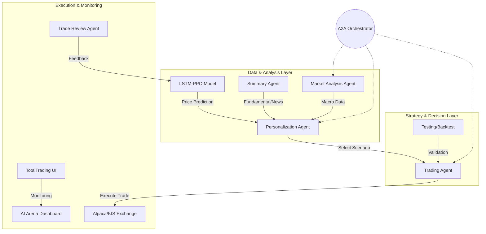

# 🤖 Bot-fett AI Trading Agent Ecosystem

**Bot-fett**은 데이터 수집, 시장 분석, 전략 결정, 그리고 실행까지 전 과정을 에이전트 간의 협업(A2A, Agent-to-Agent)으로 처리하는 **AI 기반 미국 주식 자동매매 생태계**를 구축하고 있습니다.

---

## 🏗 System Architecture (A2A Workflow)

우리 시스템은 각각의 전문화된 에이전트들이 **A2A Protocol**을 통해 소통하며 최적의 투자 의사결정을 내립니다.

---

## 📂 Core Repositories

### 1. Market & Intelligence
*   **[a2a-agent-market-analysis](https://github.com/Bot-fett/a2a-agent-market-analysis)**: FRED API 기반 거시지표(S&P 500, NASDAQ, VIX, 금리) 분석 및 시장 리스크 점수 산출.
*   **[a2a-agent-summary](https://github.com/Bot-fett/a2a-agent-summary)**: Finviz 및 실시간 뉴스를 수집하고 로컬 LLM(Qwen 2.5)을 통해 정량적 종목 리포트 생성.
*   **[lstm_ppo](https://github.com/Bot-fett/lstm_ppo)**: LSTM을 이용한 주가 예측과 PPO 강화학습 알고리즘을 결합한 핵심 매매 엔진.
*   **[a2a-agent-testing](https://github.com/Bot-fett/a2a-agent-testing)**: Alpaca API를 활용한 옵션 데이터 수집 및 Zero DTE 백테스팅 시스템.

### 2. Strategy & Personalization
*   **[a2a-agent-personalization](https://github.com/Bot-fett/a2a-agent-personalization)**: 시장 상황과 사용자 투자 성향을 결합하여 최적의 시나리오(9개)를 결정하는 의사결정 에이전트.
*   **[a2a-agent-trade-review](https://github.com/Bot-fett/a2a-agent-trade-review)**: 체결된 거래의 성과를 분석하고 피드백을 제공하는 리뷰 에이전트.

### 3. Infrastructure & UI
*   **[a2a-agent-orchestrator](https://github.com/Bot-fett/a2a-agent-orchestrator)**: 에이전트 간 A2A 통신 프로토콜을 구현하고 전체 시스템의 연결을 담당하는 허브.
*   **[warren-Bot-fett (TotalTrading)](https://github.com/Bot-fett/warren-Bot-fett)**: 실시간 나스닥 데이터와 AI 에이전트들의 성과를 시각화하는 AI Arena 대시보드.
*   **[a2a-agent-trading](https://github.com/Bot-fett/a2a-agent-trading)**: 거래소 API와 연동하여 실제 매매 주문을 실행하는 에이전트.

---

## 🛠 Tech Stack
- **Language**: Python 3.12+, TypeScript
- **AI/ML**: PyTorch, OpenAI GPT-5.2, Qwen 2.5 (via Ollama), Gymnasium (PPO)
- **Backend**: FastAPI, SQLAlchemy, PostgreSQL, Uvicorn
- **Frontend**: Next.js 14, TailwindCSS, Lightweight Charts
- **Infrastructure**: Docker, Docker Compose
- **Data Source**: Alpaca API, KIS API, FRED API

---
*Contact: [GitHub Profile](https://github.com/Bot-fett)*
